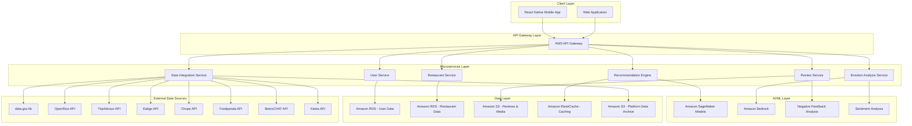

# Design Document

## Overview

The 搵食 (Find Dining) application is designed as a cloud-native, AI-powered restaurant recommendation platform built on AWS infrastructure. The system leverages machine learning models to analyze user preferences, emotional states, and dining patterns to provide highly personalized restaurant suggestions. The architecture follows microservices principles to ensure scalability, maintainability, and high availability.

## Architecture

### High-Level Architecture



### Technology Stack

- **Frontend**: React Native for cross-platform mobile development
- **Backend**: Node.js microservices deployed on Amazon EKS
- **AI/ML**: Amazon SageMaker for recommendation models, Amazon Bedrock for natural language processing
- **Database**: Amazon RDS (PostgreSQL) for structured data, Amazon S3 for unstructured data
- **Caching**: Amazon ElastiCache (Redis) for performance optimization
- **API Management**: AWS API Gateway with Lambda authorizers
- **Container Orchestration**: Amazon EKS (Elastic Kubernetes Service)

## Components and Interfaces

### 1. User Service

**Responsibilities:**
- User authentication and authorization
- User profile management
- Preference tracking and updates
- Dining history management

**Key APIs:**
- `POST /api/users/register` - User registration
- `POST /api/users/login` - User authentication
- `GET /api/users/profile` - Retrieve user profile
- `PUT /api/users/preferences` - Update dining preferences
- `GET /api/users/history` - Retrieve dining history

### 2. Restaurant Service

**Responsibilities:**
- Restaurant data management
- Menu and cuisine information
- Operating hours and location data
- Restaurant metadata (atmosphere, price range, etc.)

**Key APIs:**
- `GET /api/restaurants/search` - Search restaurants by criteria
- `GET /api/restaurants/{id}` - Get detailed restaurant information
- `GET /api/restaurants/nearby` - Get restaurants by location
- `PUT /api/restaurants/{id}` - Update restaurant information

### 3. Recommendation Engine

**Responsibilities:**
- Generate personalized restaurant recommendations
- Process user preferences and emotional state
- Integrate with ML models for prediction
- Cache and optimize recommendation results

**Key APIs:**
- `POST /api/recommendations/generate` - Generate personalized recommendations
- `POST /api/recommendations/feedback` - Process user feedback on recommendations
- `GET /api/recommendations/trending` - Get trending restaurants
- `POST /api/recommendations/emotion-based` - Get emotion-aware recommendations

### 4. Review Service

**Responsibilities:**
- Manage authentic user reviews with focus on negative feedback analysis
- Implement negative feedback-based ranking algorithms
- Filter fake reviews while preserving authentic criticism
- Aggregate multi-platform review data

**Key APIs:**
- `POST /api/reviews` - Submit new review
- `GET /api/reviews/restaurant/{id}` - Get reviews for restaurant with negative feedback analysis
- `POST /api/reviews/analyze-negative` - Analyze negative feedback patterns
- `GET /api/reviews/negative-trends/{id}` - Get negative feedback trends for restaurant
- `PUT /api/reviews/{id}/helpful` - Mark review as helpful
- `DELETE /api/reviews/{id}` - Remove inappropriate reviews

### 5. Emotion Analysis Service

**Responsibilities:**
- Process user emotional state input
- Analyze text-based mood indicators
- Map emotions to dining preferences
- Provide mood-appropriate recommendations

**Key APIs:**
- `POST /api/emotion/analyze` - Analyze user emotional state
- `GET /api/emotion/mood-mapping` - Get emotion to cuisine mapping
- `POST /api/emotion/context` - Process contextual emotional cues

### 6. Data Integration Service

**Responsibilities:**
- Aggregate restaurant data from multiple Hong Kong platforms
- Synchronize data monthly from all connected sources
- Resolve data conflicts and maintain data quality
- Validate restaurant authenticity through government sources

**Key APIs:**
- `POST /api/data/sync` - Trigger manual data synchronization
- `GET /api/data/sources` - Get status of all data sources
- `POST /api/data/validate` - Validate restaurant data across platforms
- `GET /api/data/conflicts/{restaurantId}` - Get data conflicts for resolution
- `PUT /api/data/resolve-conflict` - Resolve data conflicts manually

## Data Models

### User Model
```typescript
interface User {
  id: string;
  email: string;
  name: string;
  preferences: {
    cuisineTypes: string[];
    priceRange: [number, number];
    dietaryRestrictions: string[];
    atmospherePreferences: string[];
    spiceLevel: number;
  };
  diningHistory: DiningHistory[];
  emotionalProfile: EmotionalProfile;
  location: {
    latitude: number;
    longitude: number;
    district: string;
  };
  createdAt: Date;
  updatedAt: Date;
}
```

### Restaurant Model
```typescript
interface Restaurant {
  id: string;
  name: string;
  cuisineType: string[];
  location: {
    address: string;
    latitude: number;
    longitude: number;
    district: string;
  };
  priceRange: number; // 1-4 scale
  rating: number;
  negativeScore: number; // Primary ranking metric based on negative feedback
  atmosphere: string[];
  operatingHours: OperatingHours;
  menuHighlights: MenuItem[];
  specialFeatures: string[];
  isLocalGem: boolean;
  authenticityScore: number;
  governmentLicense: GovernmentLicense;
  dataQualityScore: number;
  negativeFeedbackTrends: NegativeFeedbackTrend[];
  platformData: PlatformData[];
  lastSyncDate: Date;
  createdAt: Date;
  updatedAt: Date;
}

interface GovernmentLicense {
  licenseNumber: string;
  isValid: boolean;
  healthInspectionScore?: number;
  lastInspectionDate?: Date;
  violations: string[];
}

interface NegativeFeedbackTrend {
  category: string;
  trend: 'improving' | 'declining' | 'stable';
  severity: number;
  frequency: number;
  timeframe: string;
}

interface PlatformData {
  source: ReviewSource;
  externalId: string;
  rating: number;
  reviewCount: number;
  lastUpdated: Date;
  dataReliability: number;
}
```

### Recommendation Model
```typescript
interface Recommendation {
  id: string;
  userId: string;
  restaurants: RecommendedRestaurant[];
  emotionalContext: string;
  generatedAt: Date;
  confidence: number;
  reasoning: string;
}

interface RecommendedRestaurant {
  restaurant: Restaurant;
  matchScore: number;
  reasonsForRecommendation: string[];
  emotionalAlignment: number;
}
```

### Review Model
```typescript
interface Review {
  id: string;
  userId: string;
  restaurantId: string;
  rating: number;
  content: string;
  photos: string[];
  visitDate: Date;
  isVerified: boolean;
  authenticityScore: number;
  helpfulCount: number;
  negativeScore: number;
  negativeFeedbackCategories: NegativeFeedbackCategory[];
  sentimentAnalysis: SentimentAnalysis;
  source: ReviewSource; // OpenRice, TripAdvisor, etc.
  createdAt: Date;
}

interface NegativeFeedbackCategory {
  category: 'service' | 'food_quality' | 'cleanliness' | 'value' | 'atmosphere' | 'wait_time';
  severity: number; // 1-5 scale
  confidence: number; // AI confidence in categorization
}

interface SentimentAnalysis {
  overallSentiment: 'positive' | 'negative' | 'neutral';
  negativeAspects: string[];
  positiveAspects: string[];
  authenticityScore: number;
}

type ReviewSource = 'internal' | 'openrice' | 'tripadvisor' | 'eatigo' | 'chope' | 'foodpanda' | 'bistrochat';
```

## Error Handling

### Error Response Format
```typescript
interface ErrorResponse {
  error: {
    code: string;
    message: string;
    details?: any;
    timestamp: string;
    requestId: string;
  };
}
```

### Error Categories

1. **Authentication Errors (401)**
   - Invalid credentials
   - Expired tokens
   - Insufficient permissions

2. **Validation Errors (400)**
   - Invalid input parameters
   - Missing required fields
   - Format validation failures

3. **Business Logic Errors (422)**
   - Insufficient user data for recommendations
   - Restaurant not available in user's area
   - Conflicting preference settings

4. **System Errors (500)**
   - ML model unavailable
   - Database connection failures
   - External service timeouts

### Retry and Fallback Strategies

- **Recommendation Engine**: Fallback to popularity-based recommendations if ML models fail
- **Location Services**: Use cached location data if GPS is unavailable
- **Review Loading**: Progressive loading with cached content during network issues
- **Image Loading**: Lazy loading with placeholder images for poor connectivity

## Testing Strategy

### Unit Testing
- **Coverage Target**: 90% code coverage for all services
- **Framework**: Jest for Node.js services, React Native Testing Library for mobile
- **Focus Areas**: Business logic, data validation, API endpoints

### Integration Testing
- **API Testing**: Automated testing of all REST endpoints
- **Database Testing**: Test data persistence and retrieval operations
- **ML Model Testing**: Validate recommendation accuracy and performance
- **Third-party Integration**: Test AWS service integrations

### End-to-End Testing
- **User Journeys**: Complete user flows from registration to restaurant discovery
- **Cross-platform Testing**: Ensure consistent experience across iOS and Android
- **Performance Testing**: Load testing for recommendation generation under high traffic
- **Accessibility Testing**: Ensure app meets accessibility standards

### AI/ML Model Testing
- **Recommendation Accuracy**: A/B testing for recommendation quality
- **Bias Detection**: Monitor for algorithmic bias in restaurant suggestions
- **Emotional Analysis Validation**: Test emotion-to-recommendation mapping accuracy
- **Model Drift Monitoring**: Continuous monitoring of model performance degradation

### Performance Benchmarks
- **Recommendation Generation**: < 3 seconds response time
- **App Launch**: < 2 seconds to display initial recommendations
- **Search Results**: < 1 second for location-based queries
- **Image Loading**: Progressive loading within 5 seconds on 3G networks

### Security Testing
- **Authentication**: Test JWT token security and session management
- **Data Privacy**: Ensure user data encryption and GDPR compliance
- **API Security**: Test for injection attacks and unauthorized access
- **Infrastructure Security**: Regular security audits of AWS resources