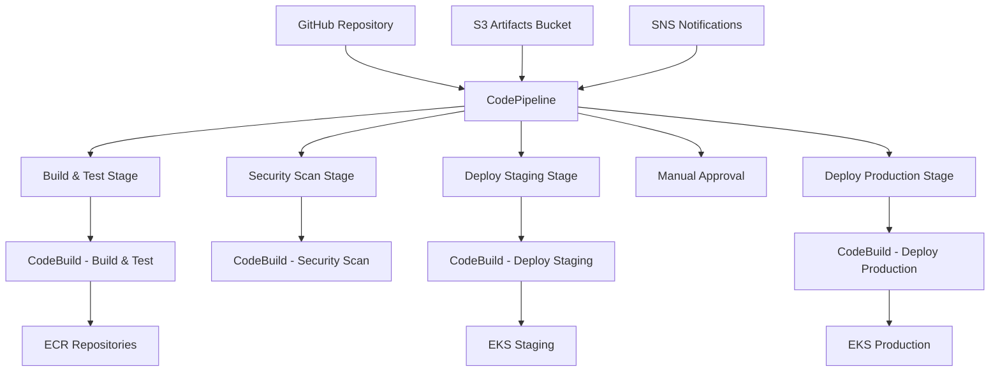
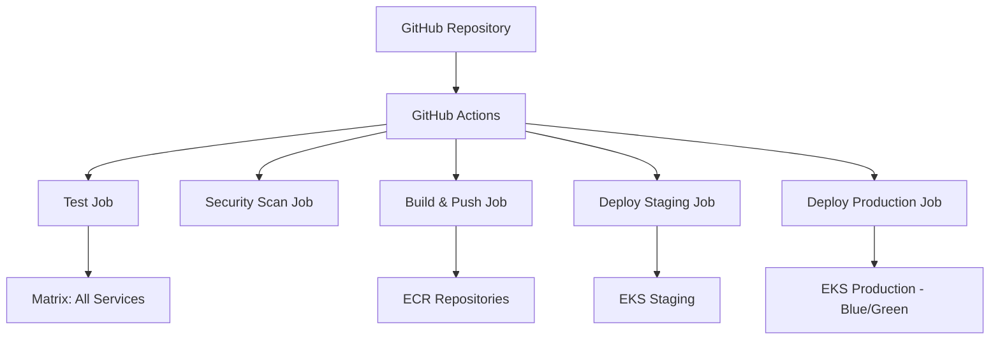

# CI/CD Pipeline Documentation

## Overview

The AI Restaurant Recommendation System uses a comprehensive CI/CD pipeline that supports both AWS CodePipeline and GitHub Actions for automated building, testing, security scanning, and deployment.

## Architecture

### AWS CodePipeline Architecture



### GitHub Actions Architecture



## Pipeline Stages

### 1. Source Stage
- **Trigger**: Push to main branch or pull request
- **Source**: GitHub repository
- **Output**: Source code artifacts

### 2. Build and Test Stage
- **Duration**: ~10-15 minutes
- **Actions**:
  - Install dependencies for all services
  - Run ESLint for code quality
  - Execute unit tests with coverage
  - Build TypeScript services
  - Build Docker images
  - Push images to ECR
  - Run integration tests

### 3. Security Scan Stage
- **Duration**: ~5-10 minutes
- **Actions**:
  - NPM audit for dependency vulnerabilities
  - Snyk security scanning
  - Retire.js for JavaScript vulnerabilities
  - Trivy container image scanning
  - ESLint security rules
  - Terraform security scanning with Checkov
  - Secret detection with TruffleHog

### 4. Deploy Staging Stage
- **Duration**: ~5-8 minutes
- **Actions**:
  - Deploy to staging namespace
  - Rolling update deployment strategy
  - Health checks and smoke tests
  - Performance validation

### 5. Manual Approval Stage (AWS CodePipeline only)
- **Duration**: Manual
- **Actions**:
  - Review staging deployment
  - Approve for production deployment

### 6. Deploy Production Stage
- **Duration**: ~10-15 minutes
- **Actions**:
  - Blue-green deployment strategy
  - Zero-downtime deployment
  - Comprehensive health checks
  - Smoke tests
  - Automatic rollback on failure

## Deployment Strategies

### Staging Environment
- **Strategy**: Rolling Update
- **Downtime**: Minimal (service-by-service)
- **Rollback**: Kubernetes rollout undo
- **Health Checks**: Basic health endpoints

### Production Environment
- **Strategy**: Blue-Green Deployment
- **Downtime**: Zero
- **Rollback**: Automatic on failure, manual script available
- **Health Checks**: Comprehensive health and smoke tests

## Configuration

### AWS CodePipeline Setup

1. **Prerequisites**:
   ```bash
   # Set up Terraform variables
   export TF_VAR_github_owner="your-github-username"
   export TF_VAR_github_repo="your-repo-name"
   export TF_VAR_github_token="your-github-token"
   ```

2. **Deploy Infrastructure**:
   ```bash
   cd infrastructure/terraform
   terraform init
   terraform plan
   terraform apply
   ```

3. **Configure Secrets**:
   - Database connection strings
   - API keys for external services
   - JWT secrets

### GitHub Actions Setup

1. **Repository Secrets**:
   ```
   AWS_ACCESS_KEY_ID
   AWS_SECRET_ACCESS_KEY
   AWS_ACCOUNT_ID
   USER_DB_URL
   RESTAURANT_DB_URL
   REDIS_URL
   JWT_SECRET
   OPENRICE_API_KEY
   TRIPADVISOR_API_KEY
   SNYK_TOKEN (optional)
   ```

2. **Environment Protection Rules**:
   - Staging: Auto-deploy on main branch
   - Production: Require manual approval

## Scripts and Tools

### Deployment Scripts

#### Blue-Green Deployment
```bash
./infrastructure/scripts/blue-green-deploy.sh production v1.2.3
```

#### Health Checks
```bash
./infrastructure/scripts/health-check.sh production
```

#### Smoke Tests
```bash
./infrastructure/scripts/smoke-tests.sh production
```

#### Rollback
```bash
./infrastructure/scripts/rollback-deployment.sh production user-service v1.2.2
```

### Build Specifications

#### Build and Test (`buildspec-build-test.yml`)
- Multi-service build with shared dependencies
- Parallel testing with coverage reports
- Docker image building and pushing
- Integration test execution

#### Security Scan (`buildspec-security.yml`)
- Dependency vulnerability scanning
- Container image security analysis
- Static code analysis
- Infrastructure security validation

#### Deployment (`buildspec-deploy.yml`)
- Environment-specific deployments
- Blue-green strategy for production
- Health checks and smoke tests
- Rollback on failure

## Monitoring and Notifications

### Pipeline Monitoring
- **CloudWatch**: Pipeline execution logs
- **SNS**: Pipeline state change notifications
- **CloudWatch Events**: Automated alerting

### Deployment Monitoring
- **Health Checks**: Automated endpoint testing
- **Smoke Tests**: Functional validation
- **Resource Monitoring**: CPU, memory, and network usage
- **Log Analysis**: Error detection and alerting

## Security Features

### Container Security
- **Image Scanning**: Trivy vulnerability scanning
- **Base Images**: Official Node.js images with security updates
- **Multi-stage Builds**: Minimal production images
- **Non-root Users**: Containers run as non-root

### Infrastructure Security
- **IAM Roles**: Least privilege access
- **VPC Security**: Network segmentation
- **Secrets Management**: AWS Secrets Manager integration
- **Encryption**: Data at rest and in transit

### Code Security
- **Dependency Scanning**: NPM audit and Snyk
- **Static Analysis**: ESLint security rules
- **Secret Detection**: TruffleHog scanning
- **Code Quality**: SonarQube integration (optional)

## Troubleshooting

### Common Issues

#### Build Failures
```bash
# Check build logs
aws logs get-log-events --log-group-name /aws/codebuild/find-dining-build-test

# Retry failed build
aws codebuild start-build --project-name find-dining-build-test
```

#### Deployment Failures
```bash
# Check deployment status
kubectl get deployments -n production

# View pod logs
kubectl logs -l app=user-service -n production

# Rollback deployment
./infrastructure/scripts/rollback-deployment.sh production
```

#### Health Check Failures
```bash
# Run manual health check
./infrastructure/scripts/health-check.sh production user-service

# Check service endpoints
kubectl get endpoints -n production

# Test service connectivity
kubectl port-forward service/user-service 8080:3000 -n production
curl http://localhost:8080/health
```

### Performance Optimization

#### Build Performance
- **Caching**: NPM and Docker layer caching
- **Parallel Builds**: Matrix strategy for services
- **Incremental Builds**: Only build changed services

#### Deployment Performance
- **Resource Limits**: Appropriate CPU and memory limits
- **Readiness Probes**: Fast startup detection
- **Rolling Updates**: Controlled rollout speed

## Best Practices

### Code Quality
- **Test Coverage**: Minimum 80% coverage required
- **Linting**: ESLint with strict rules
- **Type Safety**: TypeScript strict mode
- **Documentation**: Comprehensive README files

### Security
- **Regular Updates**: Automated dependency updates
- **Vulnerability Scanning**: Continuous security monitoring
- **Access Control**: Role-based access to environments
- **Audit Logging**: Complete deployment audit trail

### Deployment
- **Environment Parity**: Consistent staging and production
- **Database Migrations**: Automated and reversible
- **Feature Flags**: Gradual feature rollout
- **Monitoring**: Comprehensive observability

## Maintenance

### Regular Tasks
- **Dependency Updates**: Weekly automated updates
- **Security Patches**: Immediate critical updates
- **Performance Review**: Monthly performance analysis
- **Cost Optimization**: Quarterly resource review

### Backup and Recovery
- **Database Backups**: Daily automated backups
- **Configuration Backups**: Infrastructure as code
- **Disaster Recovery**: Multi-region failover capability
- **Recovery Testing**: Quarterly disaster recovery drills

## Support and Escalation

### On-call Procedures
1. **Alert Response**: 15-minute response time
2. **Incident Assessment**: Severity classification
3. **Rollback Decision**: Automatic or manual rollback
4. **Post-incident Review**: Root cause analysis

### Contact Information
- **DevOps Team**: devops@finddining.com
- **On-call Engineer**: +852-XXXX-XXXX
- **Escalation Manager**: manager@finddining.com